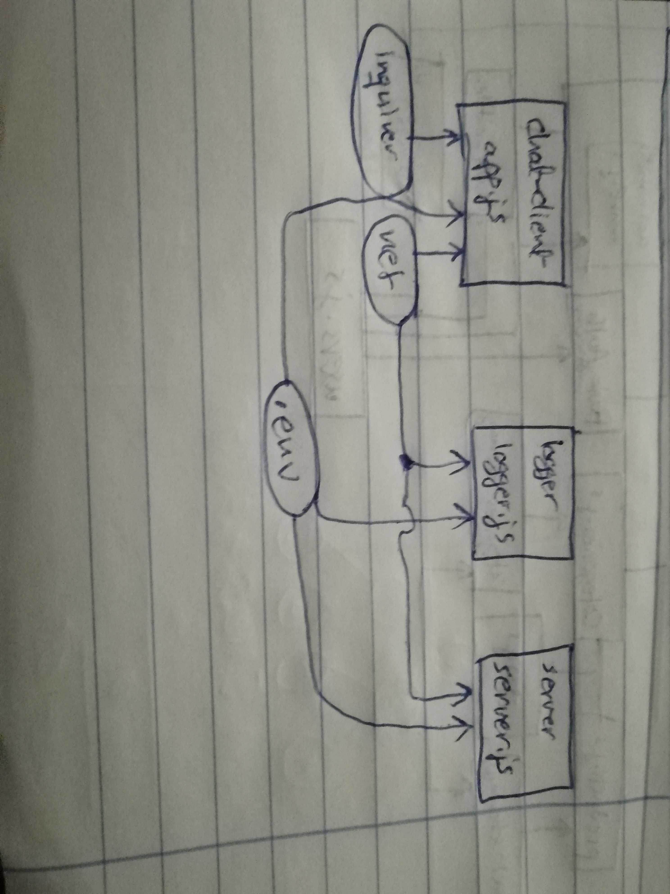

# lab-17

## TCP Server Message Application

### Author: Ayman Alkhawaldeh

### Links and Resources

- [submission PR]()

#### `.env` requirements
- `PORT` - 3001

#### Worked as a group
  - Ayman J. Al-Khawaldeh
  - Qusai A. Al-Hanaktah
  - Mohammad S. Al-Hawamdeh
  - Ahmad K. Al-Mahasneh

#### UML

